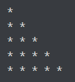
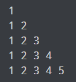
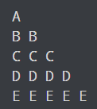
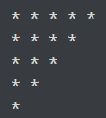
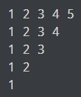
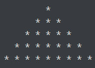
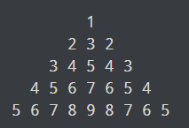
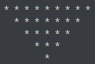
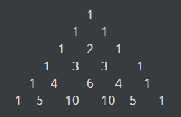
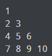

# Interview Questions
3. What is break, continue and pass statement?
    
    |Statement|Definition|
    |---|-----|
    |Break|Allows loop termination when some condition is met and the control is transferred to the next statement.|
    |Continue|Allows skipping some part of a loop when some specific condition is met and the control is transferred to the beginning of the loop|
    |Pass|Used when you need some block of code syntactically, but you want to skip its execution. This is basically a null operation. Nothing happens when this is executed.|

4. xrange() vs range()
In Python 2 we have the following two functions to produce a list of numbers within a given range.

* range()
* xrange()
in Python 3, xrange() is deprecated, i.e. xrange() is removed from python 3.x.

5. ternary operator
The Ternary operator is the operator that is used to show the conditional statements

x = 5 if 5 < 3 else 6

## Programs

1. Program to calculate the sum of first n natural number.
2. Program to find the factorial value of n number. 
3. Program to find a number is a Armstrong number or not.
4. Program to print out all Armstrong numbers between 1 and 1000.
5. Program to print Fibonacci series of n terms.
6. Program to find all Perfect numbers between 1 to n.
7. perfect number is a positive integer that is equal to the sum of its positive divisors, excluding the number itself. For instance, 6 has divisors 1, 2 and 3 (excluding itself), and 1 + 2 + 3 = 6, so 6 is a perfect number. 
8. Program to print all Prime numbers between 1 to n.
9. Program to find sum of all prime numbers between 1 to n.
10. Program to print patterns & pyramids 
    1. Half Pyramid of *
      
          
    2. Half Pyramid of Numbers
      
          
    3. Half Pyramid of Alphabets
      
          
    4. Inverted half pyramid of *
      
          
    5. Inverted half pyramid of numbers
      
          
    6. Full Pyramid of *
      
          
    7. Full Pyramid of Numbers
      
          
    8. Inverted full pyramid of *
      
          
    9. Pascal's Triangle
      
          
    10. Floyd's Triangle
       
           
11. Certainly! Here are 50 Python programming questions related to looping statements:
12. Write a program to print the numbers from 1 to 10.
13. Write a program to calculate the sum of all numbers from 1 to 100.
14. Write a program to print the multiplication table of a given number.
15. Write a program to find the factorial of a given number.
16. Write a program to check if a given number is prime.
17. Write a program to find the Fibonacci series up to a given limit.
18. Write a program to print the reverse of a given number.
19. Write a program to calculate the sum of all even numbers from 1 to 100.
20. Write a program to print the first N natural numbers.
21. Write a program to calculate the sum of digits in a given number.
22. Write a program to check if a given number is a palindrome.
23. Write a program to generate the following pattern:
    *
    **
    ***
    ****
24. Write a program to calculate the factorial of a given number using a while loop.
25. Write a program to find the largest among three numbers using a loop.
26. Write a program to print the numbers from 10 to 1 in descending order.
27. Write a program to calculate the average of a list of numbers.
28. Write a program to find the GCD (Greatest Common Divisor) of two numbers.
29. Write a program to generate the following pattern:
    1
    12
    123
    1234
30. Write a program to print the sum of all odd numbers from 1 to 100.
31. Write a program to check if a given string is a palindrome using a while loop.
32. Write a program to find the sum of all digits in a given number using a loop.
33. Write a program to generate the following pattern:
    1
    22
    333
    4444
34. Write a program to calculate the power of a number using a loop.
35. Write a program to find the factorial of a given number using a for loop.
36. Write a program to check if a given number is Armstrong number.
37. Write a program to print the numbers from 1 to 100, but replace multiples of 3 with "Fizz" and multiples of 5 with "Buzz".
38. Write a program to find the sum of all prime numbers between 1 and 100.
39. Write a program to calculate the sum of all numbers in a given list.
40. Write a program to print the first N terms of the Fibonacci series.
41. Write a program to check if a given number is a perfect number.
42. Write a program to find the LCM (Least Common Multiple) of two numbers.
43. Write a program to generate the following pattern:
    *****
    ****
    ***
    **
    *
44. Write a program to print the multiplication table of a given number using a for loop.
45. Write a program to calculate the sum of all even digits in a given number.
46. Write a program to find the sum of all numbers between two given numbers.
47. Write a program to find the factorial of a given number using a do-while loop.
48. Write a program to check if a given string is a palindrome using a for loop.
49. Write a program to find the sum of all numbers in a given matrix.
50. Write a program to generate the following pattern:
    1
    23
    456
    78910
51. Write a program to calculate the sum of all digits in a given number using a for loop.
52. Write a program to print the numbers from 1 to 100, but replace multiples of both 3 and 5 with "FizzBuzz". 
53. Write a program to find the sum of all prime numbers between two given numbers.
54. Write a program to calculate the product of all numbers in a given list.
55. Write a program to print the first N terms of the Fibonacci series using a while loop.
56. Write a program to check if a given number is a strong number.
57. Write a program to find the sum of all digits in a given number using a do-while loop.
58. Write a program to generate the following pattern:
    54321
    5432
    543
    54
    5
59. Write a program to calculate the sum of all odd digits in a given number.
60. Write a program to find the average of all numbers in a given matrix.
61. Write a program to generate the following pattern:
    1
    121
    12321
    1234321

These questions cover a wide range of topics and can help you practice your looping skills in Python. Enjoy coding!
