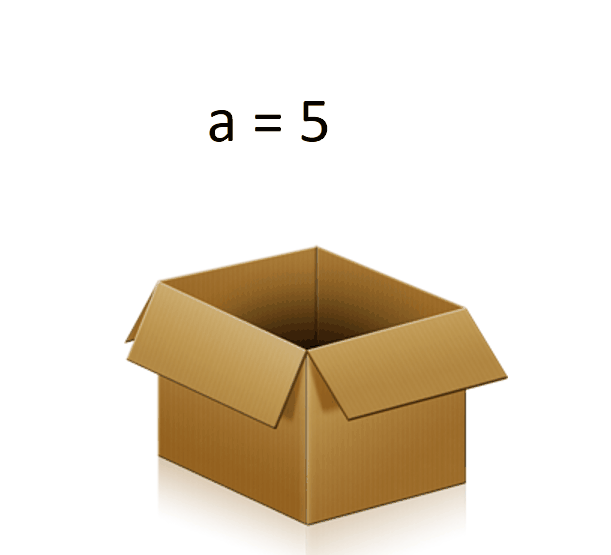

# Variables 

A variable is something which can change. A variable is a way of referring to a memory location used by a computer program. 
In many programming languages a variable is a symbolic name for this physical location. This memory location contains values, like numbers, text or more complicated types. 
You can use this variable to tell the computer to save some data in this location or to retrieve some data from this location.

While you see in other languages like C, C++ and Java. Variable names have to be declared before assign a value. For example,

int a;

a=5;

int b;

b=7;

But in python there is no need for an explicit declaration to reserve memory. 
The assignment is done using the equal to (=). For example,

a=5

b=6

## Rules for variables
1. Variables names must start with a letter or an underscore, such as:

_underscore

underscore_
2. The remainder of your variable name may consist of letters, numbers and underscores.
mark1
half_score
3. Names are case sensitive. 
case_sensitive, CASE_SENSITIVE, and Case_Sensitive are each a different variable.

# Reserved Words 
|Reserved ||||
|-----|-----|----|----|
|False | def |if|raise|
|None|del|import|return|
|True|elif|in|try|
|and|else|is|while|
|as	|except	|lambda	|with|
|assert|finally|nonlocal|yield
|break|for|not|class|	
|from|or|continue|global	
|pass

# Operators
### Arithmetic operators
|OPERATOR|DESCRIPTION|SYNTAX|
|--------|-----------|------|
|+	|Addition: adds two operands|	a + b|
|-	|Subtraction: subtracts two operands|	a - b|
|*	|Multiplication: multiplies two operands|	a * b|
|/	|Division (float): divides the first operand by the second|	a / b|
|//	|Division (floor): divides the first operand by the second|	a // b|
|%	|Modulus: returns the remainder when first operand is divided by the second|	a % b|
### Relational Operators
|OPERATOR|	DESCRIPTION|SYNTAX|
|--------|-------------|------|
|'>	|Greater than: True if left operand is greater than the right|	a > b|
|<	|Less than: True if left operand is less than the right|	a < b|
|==	|Equal to: True if both operands are equal|	a == b|
|!=	|Not equal to - True if operands are not equal|	a != b|
|>=	|Greater than or equal to: True if left operand is greater than or equal to the right|	a >= b|
|<=	|Less than or equal to: True if left operand is less than or equal to the right|	a <= b|
### Logical operators
|OPERATOR|	DESCRIPTION|SYNTAX|
|--------|-------------|------|
|and|	Logical AND: True if both the operands are true|	a and b|
|or|	Logical OR: True if either of the operands is true|	a or b|
|not|	Logical NOT: True if operand is false|	not a|
### Assignment operators
|OPERATOR|	DESCRIPTION|SYNTAX|
|--------|-------------|------|
|=|	Assign value of right side of expression to left side operand|	x = y + z|
|+=	|Add AND: Add right side operand with left side operand and then assign to left operand	|a+=b     a=a+b|
|-=	|Subtract AND: Subtract right operand from left operand and then assign to left operand	|a-=b      a=a-b|
|*=	|Multiply AND: Multiply right operand with left operand and then assign to left operand	|a*=b       a=a*b|
|/=	|Divide AND: Divide left operand with right operand and then assign to left operand	|a/=b      a=a/b|
|%=	|Modulus AND: Takes modulus using left and right operands and assign result to left operand	|a%=b   a=a%b|
|//=	|Divide(floor) AND: Divide left operand with right operand and then assign the value(floor) to left operand	|a//=b       a=a//b|
|**=	|Exponent AND: Calculate exponent(raise power) value using operands and assign value to left operand	|a**=b     a=a**b|
|&=	|Performs Bitwise AND on operands and assign value to left operand	|a&=b     a=a&b|